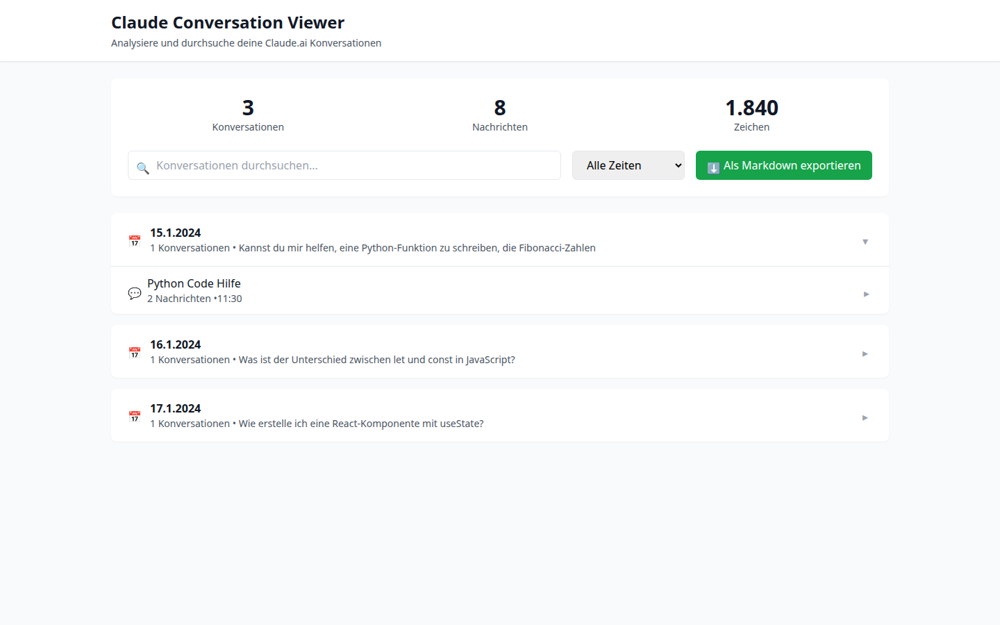
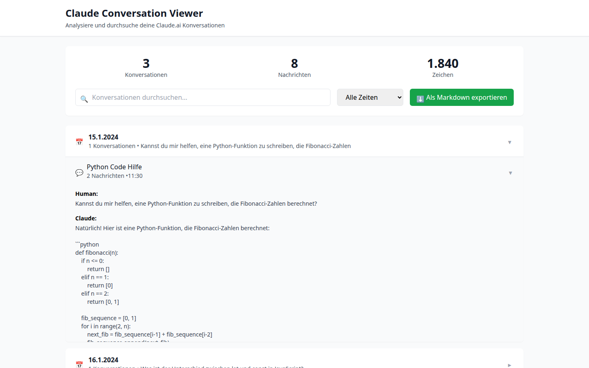
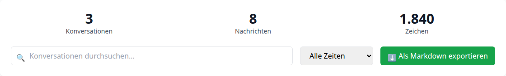

# Claude Conversation Viewer

A React-based tool to visualize and analyze your Claude.ai conversation exports with an intuitive, day-grouped interface.

## 🎯 Features

- 📅 **Day Grouping**: Conversations organized by date with intelligent AI-generated summaries
- 🔍 **Advanced Search**: Search through all conversations and messages
- 📊 **Statistics**: View total conversations, messages, and character counts
- 🗓️ **Time Filters**: Filter by "Last 7 days", "This week", "Last 30 days" and more
- 💾 **Markdown Export**: Export filtered conversations to Markdown format
- 🎨 **Intuitive UI**: Collapsible day views with conversation titles and previews
- 🐛 **Debug Mode**: Built-in JSON structure analyzer for troubleshooting

## 🚀 Getting Started

### Option 1: Use Online (Recommended)

Simply visit: [https://github.com/codeme-ne/claude-conversation-analyzer/](https://github.com/codeme-ne/claude-conversation-analyzer/)


### Option 2: Download and Run Locally

1. Download the `index.html` file
2. Open it in any modern web browser (Chrome, Firefox, Edge, Safari)
3. Upload your `conversations.json` file
4. Start exploring your conversations!

### Option 3: Clone and Customize

```bash
git clone https://github.com/yourusername/claude-conversation-viewer.git
cd claude-conversation-viewer
# Open index.html in your browser
```

## 📝 How to Export Your Claude Conversations

1. Go to [Claude.ai](https://claude.ai)
2. Click on your profile icon → Settings → Account
3. Click on "Export data"
4. Download the ZIP file
5. Extract the `conversations.json` file
6. Upload it to the Claude Conversation Viewer

## 🔧 Supported JSON Formats

The tool automatically detects and supports various Claude export formats:
- Latest format with `conversations` as an object with IDs
- Legacy formats with conversation arrays
- Different message structures (with or without timestamps, citations, etc.)
- Nested message formats with `mapping` objects

## 📸 Screenshots

### Day View with Summaries


### Conversation Details


### Statistics Overview


## 🛠️ Technical Details

Built with:
- **React 18** - UI framework
- **Tailwind CSS** - Styling
- **Lucide Icons** - Icon set
- **No build process required** - Runs directly in browser

Features:
- Fully client-side - your data never leaves your browser
- Responsive design - works on desktop and mobile
- Fast performance - handles large conversation histories
- Smart text extraction from complex message structures

## 🤝 Contributing

Contributions are welcome! Here's how you can help:

1. Fork the repository
2. Create your feature branch (`git checkout -b feature/AmazingFeature`)
3. Commit your changes (`git commit -m 'Add some AmazingFeature'`)
4. Push to the branch (`git push origin feature/AmazingFeature`)
5. Open a Pull Request

### Ideas for Contributions

- [ ] Add more export formats (PDF, CSV)
- [ ] Implement conversation search highlighting
- [ ] Add data visualization charts
- [ ] Support for multiple file uploads
- [ ] Conversation tagging system
- [ ] Dark mode support
- [ ] Localization to other languages

## 🐛 Troubleshooting

**No conversations showing?**
- Enable Debug Mode to see the JSON structure
- Check if your JSON file is from a Claude export
- Try refreshing the page and re-uploading

**Messages not displaying correctly?**
- The tool supports various message formats
- If you encounter issues, please open an issue with a sample of your JSON structure (remove personal
